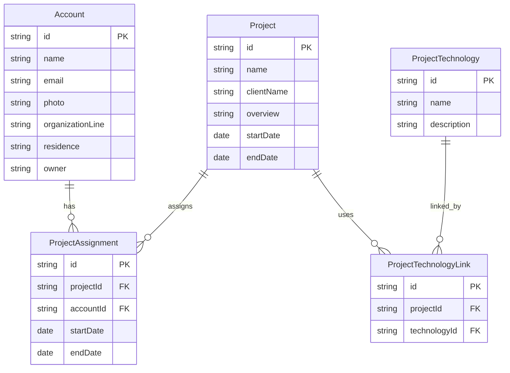

# Agile Studio タレントマネジメントシステム 設計書

## 1. システム概要

### 1.1 システム名

Agile Studio タレントマネジメントシステム

### 1.2 目的

受託開発部門におけるエンジニアの人材情報、プロジェクト履歴、技術スキルを統一的に管理し、適切な人材アサインメントとスキル可視化を支援する。

### 1.3 適用範囲

- エンジニア個人情報の管理
- プロジェクト情報の管理
- 技術スキルの管理
- プロジェクトアサインメントの管理

## 2. システムアーキテクチャ

### 2.1 全体アーキテクチャ

```
┌─────────────────┐    ┌──────────────────┐    ┌─────────────────┐
│   Web Browser   │◄──►│  AWS CloudFront  │◄──►│ AWS Amplify Gen2 │
│   (React SPA)   │    │    (CDN/SSR)     │    │   (Backend)     │
└─────────────────┘    └──────────────────┘    └─────────────────┘
                                                          │
                                                          ▼
                                               ┌─────────────────┐
                                               │  AWS Services   │
                                               │  - Cognito      │
                                               │  - DynamoDB     │
                                               │  - Lambda       │
                                               └─────────────────┘
```

### 2.2 技術スタック

#### フロントエンド

- **React 19**: UIライブラリ
- **React Router v7**: ルーティング・SSR対応
- **TypeScript**: 型安全な開発
- **Tailwind CSS v4**: スタイリング
- **shadcn/ui**: コンポーネントライブラリ
- **Vite**: ビルドツール

#### バックエンド

- **AWS Amplify Gen2**: フルマネージドバックエンド
- **GraphQL**: API仕様
- **AWS DynamoDB**: データベース
- **AWS Cognito**: 認証・認可
- **AWS Lambda**: サーバーレス関数

#### インフラストラクチャ

- **AWS Amplify Hosting**: ホスティング・CI/CD
- **AWS CloudFront**: CDN
- **AWS Route 53**: DNS（必要に応じて）

## 3. データ設計

### 3.1 論理データモデル



### 3.2 物理データモデル（DynamoDB）

#### テーブル構成

- **Account**: パーティションキー = id
- **Project**: パーティションキー = id
- **ProjectTechnology**: パーティションキー = id
- **ProjectAssignment**: パーティションキー = id
- **ProjectTechnologyLink**: パーティションキー = id

#### セカンダリインデックス

- **Account**: email によるGSI（グローバルセカンダリインデックス）

### 3.3 データ制約

#### Account

- name: 必須、最大100文字
- email: 必須、email形式、一意制約
- organizationLine: 必須
- residence: 必須

#### Project

- name: 必須、最大200文字
- clientName: 必須、最大200文字
- overview: 必須、最大1000文字
- startDate: 必須、日付形式
- endDate: 任意、日付形式

#### ProjectTechnology

- name: 必須、最大100文字
- description: 任意、最大500文字

## 4. 機能設計

### 4.1 機能一覧

#### 4.1.1 認証機能

- **ユーザー登録**: メールアドレスによる新規ユーザー登録
- **ログイン**: メール・パスワード認証
- **ログアウト**: セッション終了
- **自動アカウント作成**: 認証後の自動Accountレコード生成

#### 4.1.2 アカウント管理機能

- **一覧表示**: 全アカウントの一覧表示
- **詳細表示**: 個別アカウントの詳細情報表示
- **新規作成**: 新しいアカウントの作成
- **編集**: 既存アカウントの更新
- **削除**: アカウントの削除（論理削除）
- **CSVインポート**: CSV一括アカウント登録

#### 4.1.3 プロジェクト管理機能

- **一覧表示**: 全プロジェクトの一覧表示
- **詳細表示**: 個別プロジェクトの詳細情報表示
- **新規作成**: 新しいプロジェクトの作成
- **編集**: 既存プロジェクトの更新
- **削除**: プロジェクトの削除

#### 4.1.4 技術管理機能

- **一覧表示**: 全技術の一覧表示
- **詳細表示**: 個別技術の詳細情報表示
- **新規作成**: 新しい技術の作成
- **編集**: 既存技術の更新
- **削除**: 技術の削除

#### 4.1.5 プロジェクトアサインメント機能

- **アサインメント管理**: アカウント編集時のプロジェクトアサインメント
- **期間管理**: アサインメント期間の設定・変更

### 4.2 画面設計

#### 4.2.1 画面構成

```
┌─────────────────────────────────────────────────────────┐
│ Header Navigation                                       │
├─────────────┬───────────────────────────────────────────┤
│             │                                           │
│  Sidebar    │          Main Content Area                │
│             │                                           │
│ - Home      │  ┌─────────────────────────────────────┐  │
│ - Accounts  │  │                                     │  │
│ - Projects  │  │        Page Content                 │  │
│ - Tech      │  │                                     │  │
│             │  └─────────────────────────────────────┘  │
└─────────────┴───────────────────────────────────────────┘
```

#### 4.2.2 レスポンシブ対応

- **デスクトップ**: サイドバー常時表示
- **タブレット**: 折りたたみ可能サイドバー
- **モバイル**: ハンバーガーメニュー

### 4.3 API設計

#### 4.3.1 GraphQL Schema

```graphql
type Account
  @model
  @auth(
    rules: [
      { allow: public, operations: [read] }
      { allow: owner, operations: [create, update, delete] }
      { allow: groups, groups: ["Admin"] }
    ]
  ) {
  id: ID!
  name: String!
  email: AWSEmail! @index(name: "byEmail")
  photo: String
  organizationLine: String!
  residence: String!
  owner: String
  projects: [ProjectAssignment] @hasMany(indexName: "byAccount", fields: ["id"])
}

type Project
  @model
  @auth(
    rules: [
      { allow: public, operations: [read] }
      { allow: groups, groups: ["Admin"], operations: [create, update, delete] }
    ]
  ) {
  id: ID!
  name: String!
  clientName: String!
  overview: String!
  startDate: AWSDate!
  endDate: AWSDate
  assignments: [ProjectAssignment]
    @hasMany(indexName: "byProject", fields: ["id"])
  technologies: [ProjectTechnologyLink]
    @hasMany(indexName: "byProject", fields: ["id"])
}

type ProjectTechnology @model @auth(rules: [{ allow: public }]) {
  id: ID!
  name: String!
  description: String
  projects: [ProjectTechnologyLink]
    @hasMany(indexName: "byTechnology", fields: ["id"])
}

type ProjectAssignment
  @model
  @auth(
    rules: [
      { allow: public, operations: [read] }
      { allow: groups, groups: ["Admin"], operations: [create, update, delete] }
    ]
  ) {
  id: ID!
  projectId: ID! @index(name: "byProject")
  accountId: ID! @index(name: "byAccount")
  startDate: AWSDate!
  endDate: AWSDate
  project: Project @belongsTo(fields: ["projectId"])
  account: Account @belongsTo(fields: ["accountId"])
}

type ProjectTechnologyLink
  @model
  @auth(
    rules: [
      { allow: public, operations: [read] }
      { allow: groups, groups: ["Admin"], operations: [create, update, delete] }
    ]
  ) {
  id: ID!
  projectId: ID! @index(name: "byProject")
  technologyId: ID! @index(name: "byTechnology")
  project: Project @belongsTo(fields: ["projectId"])
  technology: ProjectTechnology @belongsTo(fields: ["technologyId"])
}
```

## 5. セキュリティ設計

### 5.1 認証・認可方式

#### 5.1.1 認証

- **AWS Cognito**: ユーザープール使用
- **認証方式**: メールアドレス + パスワード
- **トークン管理**: JWT形式のアクセストークン

#### 5.1.2 認可

```
┌─────────────────┬──────────────┬──────────────┬──────────────┐
│ リソース        │ 認証なし     │ 一般ユーザー │ 管理者       │
├─────────────────┼──────────────┼──────────────┼──────────────┤
│ Account         │ -            │ 読み取り     │ 全操作       │
│ Project         │ -            │ 読み取り     │ 全操作       │
│ ProjectTech     │ -            │ 全操作       │ 全操作       │
│ Assignment      │ -            │ 読み取り     │ 全操作       │
│ TechLink        │ -            │ 読み取り     │ 全操作       │
└─────────────────┴──────────────┴──────────────┴──────────────┘
```

### 5.2 データ保護

- **暗号化**: DynamoDB暗号化（保存時）
- **通信暗号化**: HTTPS強制
- **機密情報**: パスワード等はCognito管理

## 6. パフォーマンス設計

### 6.1 フロントエンド最適化

- **SSR**: 初回ロード高速化
- **Code Splitting**: 必要な時点での読み込み
- **Image Optimization**: 画像の最適化配信
- **CDN**: CloudFrontによる高速配信

### 6.2 バックエンド最適化

- **DynamoDB**: 効率的なクエリ設計
- **GraphQL**: 必要なデータのみ取得
- **Lambda**: サーバーレス高速実行
- **キャッシュ**: API応答のキャッシュ

### 6.3 パフォーマンス指標

- **ページ読み込み時間**: 3秒以内
- **API応答時間**: 500ms以内
- **First Contentful Paint**: 1.5秒以内

## 7. 運用設計

### 7.1 監視・ログ

- **CloudWatch**: アプリケーションログ・メトリクス
- **Error Tracking**: エラー発生時の通知
- **Performance Monitoring**: パフォーマンス監視

### 7.2 バックアップ・復旧

- **DynamoDB**: 自動バックアップ（PITR）
- **設定情報**: Git管理
- **復旧手順**: 自動デプロイによる迅速復旧

### 7.3 スケーラビリティ

- **DynamoDB**: 自動スケーリング
- **Lambda**: 同時実行数の自動調整
- **CloudFront**: グローバル配信

## 8. 開発・デプロイ設計

### 8.1 開発環境

```
Development → Staging → Production
     ↓           ↓         ↓
  Feature    Integration  Release
   Branch      Branch     Branch
```

### 8.2 CI/CD パイプライン

1. **Push**: Git Push
2. **Build**: Vite Build + TypeScript Check
3. **Test**: Vitest実行
4. **Deploy**: Amplify自動デプロイ
5. **Validate**: ヘルスチェック

### 8.3 品質管理

- **TypeScript**: 型チェック
- **ESLint**: コード品質チェック
- **Prettier**: コードフォーマット
- **Vitest**: 単体テスト

## 9. 制約事項・前提条件

### 9.1 技術的制約

- **AWS Amplify Gen2**: 使用必須
- **DynamoDB**: NoSQL制約
- **認証**: Cognito利用必須
- **Node.js**: v20.x以上必須（React Router v7要件）

### 9.2 業務的制約

- **部門内利用**: 全社システム連携なし
- **日本語環境**: 日本語UI必須
- **モバイル対応**: レスポンシブ必須

### 9.3 前提条件

- **AWS環境**: AWS環境利用可能
- **インターネット接続**: 常時接続環境
- **モダンブラウザ**: 最新ブラウザ対応
- **開発環境**: Node.js v20.x以上

## 10. 今後の拡張予定

### 10.1 機能拡張

- **生成AI機能**: スキル推薦・自動分類
- **高度検索**: 複合条件検索・フィルタリング
- **データ可視化**: チャート・グラフ表示
- **通知機能**: プロジェクト期限通知

### 10.2 技術拡張

- **モバイルアプリ**: React Native対応
- **API拡張**: 外部システム連携
- **BI連携**: データ分析基盤連携
