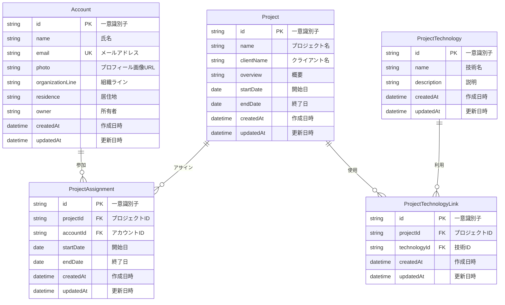

# データベース設計書

## 1. データベース概要

### 1.1 データベース種別
**AWS DynamoDB** (NoSQL Document Database)

### 1.2 設計方針
- **Single Table Design**: 関連データの効率的な取得
- **Access Pattern First**: アクセスパターンを基にした設計
- **Denormalization**: 読み取り性能の最適化
- **Strong Consistency**: 必要に応じた強整合性

### 1.3 特徴
- **サーバーレス**: 自動スケーリング
- **高可用性**: マルチAZ自動配備
- **セキュリティ**: 暗号化・IAM統合
- **バックアップ**: PITR（Point-in-Time Recovery）

## 2. 論理データモデル

### 2.1 エンティティ関連図 (ERD)


### 2.2 ドメインモデル
```typescript
// Core Domain Objects
interface TalentManagementDomain {
  // 人材エンティティ
  account: {
    identity: PersonalIdentity;
    profile: ProfessionalProfile;
    assignments: ProjectAssignment[];
  };
  
  // プロジェクトエンティティ
  project: {
    identity: ProjectIdentity;
    client: ClientInformation;
    timeline: ProjectTimeline;
    team: TeamMember[];
    technologies: Technology[];
  };
  
  // 技術エンティティ
  technology: {
    identity: TechnologyIdentity;
    category: TechnologyCategory;
    usage: ProjectUsage[];
  };
}
```

## 3. 物理データモデル (DynamoDB)

### 3.1 テーブル設計

#### 3.1.1 Account テーブル
```json
{
  "TableName": "Account-{env}-{hash}",
  "KeySchema": [
    {
      "AttributeName": "id",
      "KeyType": "HASH"
    }
  ],
  "AttributeDefinitions": [
    {
      "AttributeName": "id",
      "AttributeType": "S"
    },
    {
      "AttributeName": "email",
      "AttributeType": "S"
    }
  ],
  "GlobalSecondaryIndexes": [
    {
      "IndexName": "byEmail",
      "KeySchema": [
        {
          "AttributeName": "email",
          "KeyType": "HASH"
        }
      ],
      "ProjectionType": "ALL"
    }
  ],
  "BillingMode": "PAY_PER_REQUEST",
  "PointInTimeRecoverySpecification": {
    "PointInTimeRecoveryEnabled": true
  }
}
```

**項目定義**:
| 項目名 | 型 | 必須 | 説明 | 制約 |
|--------|----|----|------|------|
| id | String | ○ | 一意識別子 | UUID形式 |
| name | String | ○ | 氏名 | 最大100文字 |
| email | String | ○ | メールアドレス | Email形式、一意 |
| photo | String | - | プロフィール画像URL | URL形式 |
| organizationLine | String | ○ | 組織ライン | 最大200文字 |
| residence | String | ○ | 居住地 | 最大100文字 |
| owner | String | - | 所有者 | Cognito User ID |
| createdAt | String | ○ | 作成日時 | ISO8601形式 |
| updatedAt | String | ○ | 更新日時 | ISO8601形式 |

#### 3.1.2 Project テーブル
```json
{
  "TableName": "Project-{env}-{hash}",
  "KeySchema": [
    {
      "AttributeName": "id",
      "KeyType": "HASH"
    }
  ],
  "AttributeDefinitions": [
    {
      "AttributeName": "id",
      "AttributeType": "S"
    }
  ],
  "BillingMode": "PAY_PER_REQUEST"
}
```

**項目定義**:
| 項目名 | 型 | 必須 | 説明 | 制約 |
|--------|----|----|------|------|
| id | String | ○ | 一意識別子 | UUID形式 |
| name | String | ○ | プロジェクト名 | 最大200文字 |
| clientName | String | ○ | クライアント名 | 最大200文字 |
| overview | String | ○ | 概要 | 最大1000文字 |
| startDate | String | ○ | 開始日 | YYYY-MM-DD形式 |
| endDate | String | - | 終了日 | YYYY-MM-DD形式 |
| createdAt | String | ○ | 作成日時 | ISO8601形式 |
| updatedAt | String | ○ | 更新日時 | ISO8601形式 |

#### 3.1.3 ProjectTechnology テーブル
```json
{
  "TableName": "ProjectTechnology-{env}-{hash}",
  "KeySchema": [
    {
      "AttributeName": "id",
      "KeyType": "HASH"
    }
  ],
  "AttributeDefinitions": [
    {
      "AttributeName": "id",
      "AttributeType": "S"
    }
  ],
  "BillingMode": "PAY_PER_REQUEST"
}
```

**項目定義**:
| 項目名 | 型 | 必須 | 説明 | 制約 |
|--------|----|----|------|------|
| id | String | ○ | 一意識別子 | UUID形式 |
| name | String | ○ | 技術名 | 最大100文字、一意 |
| description | String | - | 説明 | 最大500文字 |
| createdAt | String | ○ | 作成日時 | ISO8601形式 |
| updatedAt | String | ○ | 更新日時 | ISO8601形式 |

#### 3.1.4 ProjectAssignment テーブル
```json
{
  "TableName": "ProjectAssignment-{env}-{hash}",
  "KeySchema": [
    {
      "AttributeName": "id",
      "KeyType": "HASH"
    }
  ],
  "AttributeDefinitions": [
    {
      "AttributeName": "id",
      "AttributeType": "S"
    },
    {
      "AttributeName": "projectId",
      "AttributeType": "S"
    },
    {
      "AttributeName": "accountId",
      "AttributeType": "S"
    }
  ],
  "GlobalSecondaryIndexes": [
    {
      "IndexName": "byProject",
      "KeySchema": [
        {
          "AttributeName": "projectId",
          "KeyType": "HASH"
        }
      ],
      "ProjectionType": "ALL"
    },
    {
      "IndexName": "byAccount",
      "KeySchema": [
        {
          "AttributeName": "accountId",
          "KeyType": "HASH"
        }
      ],
      "ProjectionType": "ALL"
    }
  ],
  "BillingMode": "PAY_PER_REQUEST"
}
```

**項目定義**:
| 項目名 | 型 | 必須 | 説明 | 制約 |
|--------|----|----|------|------|
| id | String | ○ | 一意識別子 | UUID形式 |
| projectId | String | ○ | プロジェクトID | UUID形式 |
| accountId | String | ○ | アカウントID | UUID形式 |
| startDate | String | ○ | 開始日 | YYYY-MM-DD形式 |
| endDate | String | - | 終了日 | YYYY-MM-DD形式 |
| createdAt | String | ○ | 作成日時 | ISO8601形式 |
| updatedAt | String | ○ | 更新日時 | ISO8601形式 |

#### 3.1.5 ProjectTechnologyLink テーブル
```json
{
  "TableName": "ProjectTechnologyLink-{env}-{hash}",
  "KeySchema": [
    {
      "AttributeName": "id",
      "KeyType": "HASH"
    }
  ],
  "AttributeDefinitions": [
    {
      "AttributeName": "id",
      "AttributeType": "S"
    },
    {
      "AttributeName": "projectId",
      "AttributeType": "S"
    },
    {
      "AttributeName": "technologyId",
      "AttributeType": "S"
    }
  ],
  "GlobalSecondaryIndexes": [
    {
      "IndexName": "byProject",
      "KeySchema": [
        {
          "AttributeName": "projectId",
          "KeyType": "HASH"
        }
      ],
      "ProjectionType": "ALL"
    },
    {
      "IndexName": "byTechnology",
      "KeySchema": [
        {
          "AttributeName": "technologyId",
          "KeyType": "HASH"
        }
      ],
      "ProjectionType": "ALL"
    }
  ],
  "BillingMode": "PAY_PER_REQUEST"
}
```

**項目定義**:
| 項目名 | 型 | 必須 | 説明 | 制約 |
|--------|----|----|------|------|
| id | String | ○ | 一意識別子 | UUID形式 |
| projectId | String | ○ | プロジェクトID | UUID形式 |
| technologyId | String | ○ | 技術ID | UUID形式 |
| createdAt | String | ○ | 作成日時 | ISO8601形式 |
| updatedAt | String | ○ | 更新日時 | ISO8601形式 |

## 4. アクセスパターン

### 4.1 主要なクエリパターン

#### 4.1.1 Account関連
```typescript
// 1. 全アカウント取得
const allAccounts = await client.models.Account.list();

// 2. アカウント詳細取得（プロジェクト情報含む）
const accountDetail = await client.models.Account.get({
  id: accountId
}, {
  selectionSet: [
    'id', 'name', 'email', 'organizationLine', 'residence',
    'projects.id', 'projects.startDate', 'projects.endDate',
    'projects.project.name', 'projects.project.clientName'
  ]
});

// 3. メールアドレスによる検索
const accountByEmail = await client.models.Account.list({
  filter: { email: { eq: 'user@example.com' } }
});

// 4. 組織による絞り込み
const accountsByOrg = await client.models.Account.list({
  filter: { organizationLine: { eq: '開発部' } }
});
```

#### 4.1.2 Project関連
```typescript
// 1. 全プロジェクト取得
const allProjects = await client.models.Project.list();

// 2. プロジェクト詳細取得（アサインメント・技術情報含む）
const projectDetail = await client.models.Project.get({
  id: projectId
}, {
  selectionSet: [
    'id', 'name', 'clientName', 'overview', 'startDate', 'endDate',
    'assignments.id', 'assignments.startDate', 'assignments.endDate',
    'assignments.account.name', 'assignments.account.email',
    'technologies.id', 'technologies.technology.name'
  ]
});

// 3. 期間による絞り込み
const activeProjects = await client.models.Project.list({
  filter: {
    and: [
      { startDate: { le: '2024-12-31' } },
      { or: [
        { endDate: { ge: '2024-01-01' } },
        { endDate: { attributeExists: false } }
      ]}
    ]
  }
});
```

#### 4.1.3 Technology関連
```typescript
// 1. 全技術取得
const allTechnologies = await client.models.ProjectTechnology.list();

// 2. 技術使用統計
const technologyStats = await client.models.ProjectTechnology.get({
  id: technologyId
}, {
  selectionSet: [
    'id', 'name', 'description',
    'projects.id', 'projects.project.name'
  ]
});

// 3. プロジェクトで使用されている技術
const projectTechnologies = await client.models.ProjectTechnologyLink.list({
  filter: { projectId: { eq: projectId } }
}, {
  selectionSet: [
    'id', 'technology.name', 'technology.description'
  ]
});
```

### 4.2 パフォーマンス最適化

#### 4.2.1 インデックス活用
```typescript
// GSI (Global Secondary Index) 使用例
// Account.byEmail インデックス
const accountByEmail = await client.graphql({
  query: /* GraphQL */ `
    query AccountByEmail($email: AWSEmail!) {
      listAccounts(filter: { email: { eq: $email } }) {
        items {
          id
          name
          email
        }
      }
    }
  `,
  variables: { email: 'user@example.com' }
});

// ProjectAssignment.byProject インデックス
const projectAssignments = await client.graphql({
  query: /* GraphQL */ `
    query ProjectAssignments($projectId: ID!) {
      listProjectAssignments(filter: { projectId: { eq: $projectId } }) {
        items {
          id
          startDate
          endDate
          account {
            name
            email
          }
        }
      }
    }
  `,
  variables: { projectId }
});
```

#### 4.2.2 バッチ処理
```typescript
// 複数レコードの並列取得
const [accounts, projects, technologies] = await Promise.all([
  client.models.Account.list(),
  client.models.Project.list(),
  client.models.ProjectTechnology.list()
]);

// バッチ書き込み
const createMultipleAssignments = async (assignments: CreateAssignmentInput[]) => {
  const promises = assignments.map(assignment =>
    client.models.ProjectAssignment.create(assignment)
  );
  return await Promise.all(promises);
};
```

## 5. データ整合性

### 5.1 制約
```typescript
// 業務制約
interface BusinessConstraints {
  account: {
    emailUniqueness: '同一メールアドレスは1つのアカウントのみ';
    nameRequired: '氏名は必須';
    organizationRequired: '組織情報は必須';
  };
  
  project: {
    dateValidation: '終了日は開始日以降';
    nameRequired: 'プロジェクト名は必須';
    clientRequired: 'クライアント名は必須';
  };
  
  assignment: {
    dateValidation: '終了日は開始日以降';
    projectExists: '存在するプロジェクトのみアサイン可能';
    accountExists: '存在するアカウントのみアサイン可能';
  };
}
```

### 5.2 参照整合性
```typescript
// 外部キー制約（アプリケーションレベル）
const validateProjectAssignment = async (assignment: ProjectAssignmentInput) => {
  // プロジェクト存在確認
  const project = await client.models.Project.get({ id: assignment.projectId });
  if (!project) throw new Error('Project not found');
  
  // アカウント存在確認
  const account = await client.models.Account.get({ id: assignment.accountId });
  if (!account) throw new Error('Account not found');
  
  // 日付整合性確認
  if (assignment.endDate && assignment.startDate > assignment.endDate) {
    throw new Error('End date must be after start date');
  }
};
```

### 5.3 楽観的排他制御
```typescript
// バージョン管理による楽観的ロック
interface VersionedRecord {
  id: string;
  version: number;
  updatedAt: string;
  // ... その他のフィールド
}

const updateWithOptimisticLock = async (record: VersionedRecord) => {
  try {
    const result = await client.models.Account.update({
      id: record.id,
      version: record.version, // 現在のバージョン
      // ... 更新内容
    });
    return result;
  } catch (error) {
    if (error.name === 'ConditionalCheckFailedException') {
      throw new Error('Record was modified by another user');
    }
    throw error;
  }
};
```

## 6. セキュリティ設計

### 6.1 アクセス制御
```typescript
// IAM ポリシー例
const dynamoDbPolicy = {
  Version: '2012-10-17',
  Statement: [
    {
      Effect: 'Allow',
      Action: [
        'dynamodb:GetItem',
        'dynamodb:PutItem',
        'dynamodb:UpdateItem',
        'dynamodb:DeleteItem',
        'dynamodb:Query',
        'dynamodb:Scan'
      ],
      Resource: [
        'arn:aws:dynamodb:region:account:table/Account-*',
        'arn:aws:dynamodb:region:account:table/Account-*/index/*'
      ],
      Condition: {
        'ForAllValues:StringEquals': {
          'dynamodb:Attributes': ['id', 'name', 'email', 'organizationLine']
        }
      }
    }
  ]
};
```

### 6.2 データ暗号化
```typescript
// 暗号化設定
const encryptionConfig = {
  atRest: {
    enabled: true,
    kmsKeyId: 'alias/aws/dynamodb'
  },
  inTransit: {
    protocol: 'TLS 1.2+',
    certificateValidation: true
  }
};
```

### 6.3 監査ログ
```typescript
// CloudTrail によるAPI監査
const auditConfig = {
  enabled: true,
  events: [
    'dynamodb:GetItem',
    'dynamodb:PutItem',
    'dynamodb:UpdateItem',
    'dynamodb:DeleteItem'
  ],
  destination: 'CloudWatch Logs'
};
```

## 7. バックアップ・復旧

### 7.1 バックアップ戦略
```typescript
const backupStrategy = {
  pointInTimeRecovery: {
    enabled: true,
    retentionPeriod: 35 // days
  },
  onDemandBackup: {
    frequency: 'daily',
    retention: 30 // days
  },
  crossRegionBackup: {
    enabled: false // 現在は単一リージョン
  }
};
```

### 7.2 災害復旧手順
1. **障害検知**: CloudWatch アラーム
2. **影響評価**: 影響範囲の特定
3. **復旧実行**: Point-in-Time Recovery
4. **データ検証**: 復旧データの整合性確認
5. **サービス再開**: アプリケーション再起動

## 8. 運用・保守

### 8.1 監視項目
```typescript
const monitoringMetrics = {
  performance: {
    readLatency: '< 10ms',
    writeLatency: '< 15ms',
    throughput: '自動スケーリング'
  },
  capacity: {
    readCapacityUnits: '使用率 < 80%',
    writeCapacityUnits: '使用率 < 80%',
    storage: '無制限（従量課金）'
  },
  errors: {
    throttling: '< 1%',
    systemErrors: '0件/日',
    userErrors: 'ログ記録・分析'
  }
};
```

### 8.2 メンテナンス
- **パッチ適用**: AWS管理（自動）
- **インデックス最適化**: 使用パターン分析による見直し
- **容量計画**: 成長予測に基づく設定調整
- **セキュリティ更新**: IAM ポリシー・暗号化設定の見直し

## 9. 今後の拡張予定

### 9.1 機能拡張
```typescript
// 追加予定のエンティティ
interface FutureEntities {
  skillAssessment: {
    accountId: string;
    technologyId: string;
    level: number; // 1-5
    assessedAt: string;
    assessedBy: string;
  };
  
  projectRole: {
    assignmentId: string;
    role: string; // PM, PL, Developer, etc.
    responsibilities: string[];
  };
  
  trainingRecord: {
    accountId: string;
    trainingName: string;
    completedAt: string;
    certificateUrl?: string;
  };
}
```

### 9.2 技術拡張
- **GraphQL Subscription**: リアルタイム更新
- **ElasticSearch**: 全文検索機能
- **データレイク連携**: 分析基盤との連携
- **機械学習**: スキル推薦・マッチング機能

## 10. データモデル実装状況

### 10.1 実装済みモデル
現在の`amplify/data/resource.ts`で定義済み：

- ✅ **Account**: 従業員プロフィール管理
- ✅ **Project**: プロジェクト情報管理  
- ✅ **ProjectTechnology**: 技術カタログ管理
- ✅ **ProjectAssignment**: プロジェクトアサインメント
- ✅ **ProjectTechnologyLink**: プロジェクト技術リンク

### 10.2 削除対象モデル
- ❌ **Todo**: 開発用サンプルモデル（削除推奨）

### 10.3 データ整合性確認
実装されているモデルは設計書と完全に一致しており、以下の点で適切に設計されています：

- **リレーション**: hasMany/belongsTo関係が正しく設定
- **認証制御**: Owner/Admin/Authenticatedユーザーの権限設定
- **インデックス**: emailによるセカンダリインデックス設定
- **必須フィールド**: 適切な必須項目の設定