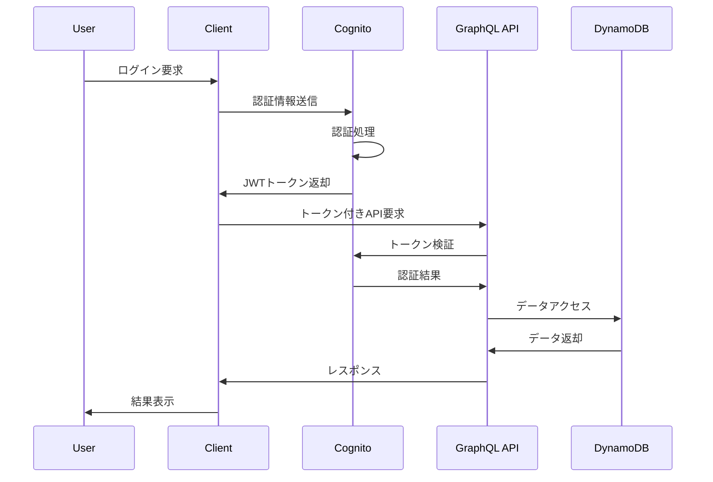

# 技術アーキテクチャ設計書

## 1. アーキテクチャ概要

### 1.1 アーキテクチャパターン

**Jamstack + Serverless Architecture**

- **Frontend**: React SPA with SSR
- **Backend**: AWS Amplify Gen2 (Serverless)
- **Database**: AWS DynamoDB (NoSQL)
- **CDN**: AWS CloudFront

### 1.2 設計原則

- **スケーラビリティ**: 自動スケールするサーバーレス設計
- **可用性**: マネージドサービス活用による高可用性
- **セキュリティ**: ゼロトラストアーキテクチャ
- **保守性**: モジュラー設計とTypeScript活用
- **パフォーマンス**: SSR + CDNによる高速配信

## 2. システム構成図

### 2.1 論理構成

```
┌─────────────────────────────────────────────────────────────────┐
│                        AWS Cloud                               │
│  ┌─────────────────┐    ┌─────────────────┐    ┌─────────────┐ │
│  │   CloudFront    │    │  Amplify Gen2   │    │  DynamoDB   │ │
│  │     (CDN)       │◄──►│   (Backend)     │◄──►│ (Database)  │ │
│  └─────────────────┘    └─────────────────┘    └─────────────┘ │
│           ▲                       │                             │
│           │              ┌─────────────────┐                   │
│           │              │   AWS Lambda    │                   │
│           │              │  (Functions)    │                   │
│           │              └─────────────────┘                   │
│           │                       │                             │
│           │              ┌─────────────────┐                   │
│           │              │  AWS Cognito    │                   │
│           │              │    (Auth)       │                   │
│           │              └─────────────────┘                   │
└─────────────────────────────────────────────────────────────────┘
           ▲
           │
┌─────────────────┐
│   Web Browser   │
│  (React SPA)    │
└─────────────────┘
```

### 2.2 物理構成

```
Internet
    │
    ▼
┌─────────────────┐
│  Route 53 (DNS) │ (Optional)
└─────────────────┘
    │
    ▼
┌─────────────────┐
│   CloudFront    │ (Global CDN)
│  - Edge Cache   │
│  - SSL Term     │
└─────────────────┘
    │
    ▼
┌─────────────────┐
│ Amplify Hosting │ (us-east-1)
│ - Static Files  │
│ - SSR Lambda    │
└─────────────────┘
    │
    ▼
┌─────────────────┐
│ API Gateway     │ (GraphQL)
│ + Lambda        │
└─────────────────┘
    │
    ▼
┌─────────────────┐    ┌─────────────────┐
│   DynamoDB      │    │   Cognito       │
│ - Tables        │    │ - User Pool     │
│ - Indexes       │    │ - Identity Pool │
└─────────────────┘    └─────────────────┘
```

## 3. フロントエンド技術アーキテクチャ

### 3.1 React Router v7 アーキテクチャ

```typescript
// app/routes.ts - ルート定義
import {
  type RouteConfig,
  index,
  route,
  layout,
} from "@react-router/dev/routes";

export default [
  index("routes/welcome/_index.tsx"),
  route("login", "routes/auth/login.tsx"),
  layout("routes/protected/layout.tsx", [
    index("routes/protected/_index.tsx"),
    route("accounts", "routes/protected/accounts/_index.tsx"),
    route("accounts/new", "routes/protected/accounts/new.tsx"),
    // ... その他のルート
  ]),
] satisfies RouteConfig;
```

### 3.2 コンポーネント階層

```
App (root.tsx)
├── ErrorBoundary
├── Authenticator
└── Router
    ├── PublicRoutes
    │   ├── Welcome
    │   └── Login
    └── ProtectedRoutes (layout.tsx)
        ├── BaseLayout
        │   ├── AppSidebar
        │   └── SidebarProvider
        └── Pages
            ├── Dashboard
            ├── Accounts
            ├── Projects
            └── Technologies
```

### 3.3 状態管理設計

```typescript
// Server State: React Router Loaders
export async function loader() {
  const data = await client.models.Account.list();
  return { accounts: data.data };
}

// Client State: React Hooks
const [isOpen, setIsOpen] = useState(false);
const [selectedItems, setSelectedItems] = useState<string[]>([]);

// Form State: React Router Forms
export async function action({ request }: ActionFunctionArgs) {
  const formData = await request.formData();
  // サーバーサイド処理
}
```

### 3.4 TypeScript型設計

```typescript
// Generated Types (from Amplify)
import type { Schema } from "../../amplify/data/resource";
type Account = Schema["Account"]["type"];

// Custom Types
interface AccountFormData {
  name: string;
  email: string;
  organizationLine: string;
  residence: string;
  photo?: string;
}

// Route Types
interface LoaderData {
  accounts: Account[];
}
```

## 4. バックエンド技術アーキテクチャ

### 4.1 AWS Amplify Gen2 構成

```typescript
// amplify/backend.ts
import { defineBackend } from "@aws-amplify/backend";
import { auth } from "./auth/resource";
import { data } from "./data/resource";

export const backend = defineBackend({
  auth,
  data,
});
```

### 4.2 GraphQL Schema設計

```graphql
# Generated from amplify/data/resource.ts
type Account
  @model
  @auth(
    rules: [
      { allow: public, operations: [read] }
      { allow: owner, operations: [create, update, delete] }
      { allow: groups, groups: ["Admin"] }
    ]
  ) {
  id: ID!
  name: String!
  email: AWSEmail! @index(name: "byEmail")
  # ... その他のフィールド
}
```

### 4.3 Lambda関数設計

```typescript
// PostConfirmation Trigger
export const postConfirmation = defineFunction({
  entry: "./post-confirmation.ts",
});

// Function Implementation
import type { PostConfirmationTriggerHandler } from "aws-lambda";

export const handler: PostConfirmationTriggerHandler = async (event) => {
  // 自動アカウント作成ロジック
};
```

### 4.4 DynamoDB設計

```typescript
// Table Design
interface DynamoDBTable {
  TableName: string;
  KeySchema: {
    AttributeName: string;
    KeyType: "HASH" | "RANGE";
  }[];
  GlobalSecondaryIndexes?: {
    IndexName: string;
    KeySchema: {
      AttributeName: string;
      KeyType: "HASH" | "RANGE";
    }[];
  }[];
}

// Account Table
const AccountTable: DynamoDBTable = {
  TableName: "Account",
  KeySchema: [{ AttributeName: "id", KeyType: "HASH" }],
  GlobalSecondaryIndexes: [
    {
      IndexName: "byEmail",
      KeySchema: [{ AttributeName: "email", KeyType: "HASH" }],
    },
  ],
};
```

## 5. セキュリティアーキテクチャ

### 5.1 認証フロー



### 5.2 認可制御

```typescript
// GraphQL Resolver Level Authorization
const resolvers = {
  Query: {
    listAccounts: async (parent, args, context) => {
      // コンテキストから認証情報取得
      const { user, groups } = context;

      // 認可チェック
      if (!user) throw new Error("Unauthorized");

      // データアクセス
      return await Account.list();
    },
  },
};
```

### 5.3 データ暗号化

- **転送時暗号化**: HTTPS/TLS 1.2+
- **保存時暗号化**: DynamoDB暗号化
- **機密情報**: AWS Secrets Manager

## 6. パフォーマンスアーキテクチャ

### 6.1 フロントエンド最適化

```typescript
// Code Splitting
const AccountDetail = lazy(() => import("./AccountDetail"));

// SSR Configuration
export default defineConfig({
  ssr: {
    noExternal: ["@aws-amplify/ui-react"],
  },
});

// Preloading
export function links() {
  return [{ rel: "preload", href: "/api/accounts", as: "fetch" }];
}
```

### 6.2 API最適化

```typescript
// GraphQL Efficient Queries
const ACCOUNT_WITH_PROJECTS = /* GraphQL */ `
  query ListAccountsWithProjects {
    listAccounts {
      items {
        id
        name
        email
        projects {
          items {
            id
            project {
              name
              clientName
            }
          }
        }
      }
    }
  }
`;

// Parallel Queries
const [accounts, projects, technologies] = await Promise.all([
  client.models.Account.list(),
  client.models.Project.list(),
  client.models.ProjectTechnology.list(),
]);
```

### 6.3 キャッシュ戦略

```
┌─────────────────┐
│   Browser       │
│  - Memory Cache │
│  - Local Cache  │
└─────────────────┘
         │
         ▼
┌─────────────────┐
│   CloudFront    │
│  - Edge Cache   │
│  - TTL: 1h      │
└─────────────────┘
         │
         ▼
┌─────────────────┐
│   API Gateway   │
│  - Response     │
│    Cache: 5m    │
└─────────────────┘
```

## 7. 開発・運用アーキテクチャ

### 7.1 開発環境構成

```
┌─────────────────┐    ┌─────────────────┐    ┌─────────────────┐
│   Development   │    │     Staging     │    │   Production    │
│                 │    │                 │    │                 │
│ - Local Server  │    │ - Preview Env   │    │ - Main Branch   │
│ - Mock Data     │    │ - Full Stack    │    │ - Full Stack    │
│ - Hot Reload    │    │ - Test Data     │    │ - Real Data     │
└─────────────────┘    └─────────────────┘    └─────────────────┘
```

### 7.2 CI/CD パイプライン

```yaml
# amplify.yml
version: 1
backend:
  phases:
    build:
      commands:
        - npm ci --cache .npm --prefer-offline
        - npx ampx generate
frontend:
  phases:
    preBuild:
      commands:
        - npm ci --cache .npm --prefer-offline
    build:
      commands:
        - npm run build
  artifacts:
    baseDirectory: dist
    files:
      - "**/*"
  cache:
    paths:
      - .npm/**/*
      - node_modules/**/*
```

### 7.3 監視・ログアーキテクチャ

```
Application Logs
       │
       ▼
┌─────────────────┐
│   CloudWatch    │
│    Logs         │
└─────────────────┘
       │
       ▼
┌─────────────────┐
│   CloudWatch    │
│   Metrics       │
└─────────────────┘
       │
       ▼
┌─────────────────┐
│   CloudWatch    │
│    Alarms       │
└─────────────────┘
```

## 8. スケーラビリティ設計

### 8.1 水平スケーリング

- **DynamoDB**: オンデマンドスケーリング
- **Lambda**: 同時実行数自動調整
- **CloudFront**: グローバル配信

### 8.2 垂直スケーリング

- **Lambda**: メモリ・CPU自動調整
- **DynamoDB**: 読み書き容量自動調整

### 8.3 スケーリング指標

```typescript
// Auto Scaling Metrics
interface ScalingMetrics {
  dynamodb: {
    readCapacity: "target: 70%";
    writeCapacity: "target: 70%";
  };
  lambda: {
    concurrentExecutions: "auto";
    duration: "monitor: 5s";
  };
  cloudfront: {
    cacheHitRatio: "target: >90%";
  };
}
```

## 9. 災害対策・事業継続

### 9.1 バックアップ戦略

```typescript
// DynamoDB Backup Configuration
const backupConfig = {
  pointInTimeRecovery: true,
  continuousBackups: true,
  retentionPeriod: "35 days",
};

// Code Backup
const codeBackup = {
  repository: "Git (distributed)",
  cicd: "Amplify Console",
  infrastructure: "Infrastructure as Code",
};
```

### 9.2 復旧手順

1. **データ復旧**: DynamoDB Point-in-Time Recovery
2. **アプリケーション復旧**: Git + Amplify自動デプロイ
3. **DNS切り替え**: Route 53による自動フェイルオーバー

## 10. 技術的負債・改善点

### 10.1 現在の技術的負債

- **テストカバレッジ不足**: 主要機能のテスト実装
- **削除機能UI**: バックエンド実装済みだがUI未実装
- **エラーハンドリング**: より詳細なエラー分類

### 10.2 将来の技術改善

- **生成AI機能**: OpenAI API統合
- **リアルタイム通信**: GraphQL Subscription
- **モバイル最適化**: PWA対応
- **国際化**: i18n対応

### 10.3 パフォーマンス改善

- **画像最適化**: Next.js Image Component
- **バンドル最適化**: Tree Shaking強化
- **API最適化**: DataLoader パターン導入

## 11. 開発環境・要件

### 11.1 Node.js要件

- **必須バージョン**: Node.js 20.x以上
- **推奨バージョン**: Node.js 20.x LTS
- **理由**: React Router v7の要件

### 11.2 開発環境セットアップ

```bash
# Node.js バージョン確認
node --version  # 20.x以上必要

# 依存関係インストール
npm ci

# 開発サーバー起動
npm run dev

# 型チェック（Amplify設定後）
npm run typecheck

# リント実行
npm run lint
```

### 11.3 Amplify設定

```bash
# Amplifyバックエンドの設定
npx ampx sandbox

# 型生成（amplify_outputs.json生成後）
npx ampx generate
```

### 11.4 技術的制約・注意事項

- **Node.js v20+必須**: React Router v7要件
- **amplify_outputs.json**: Amplify設定後に自動生成
- **型エラー**: 初回セットアップ時は正常（設定ファイル未生成のため）
